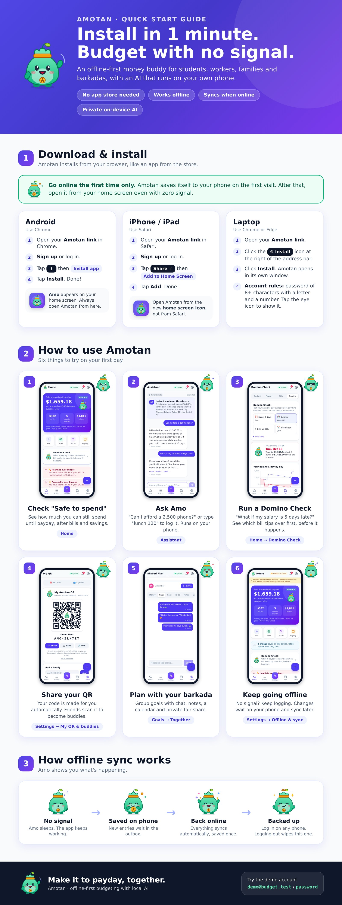
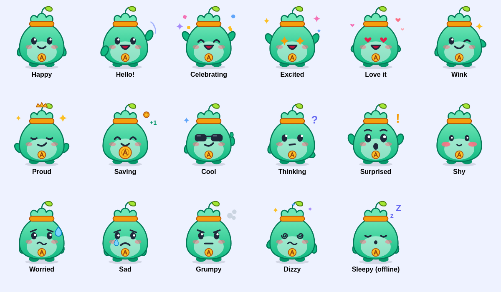
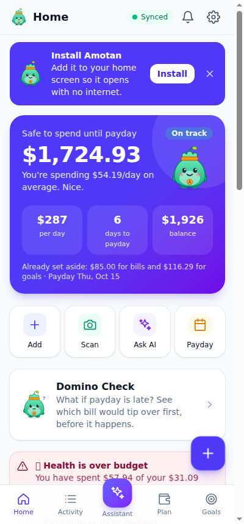
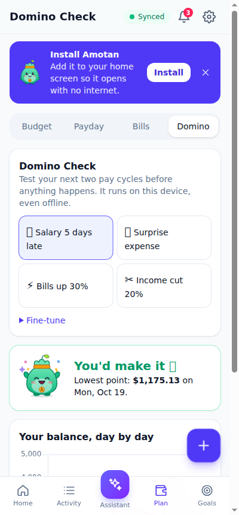
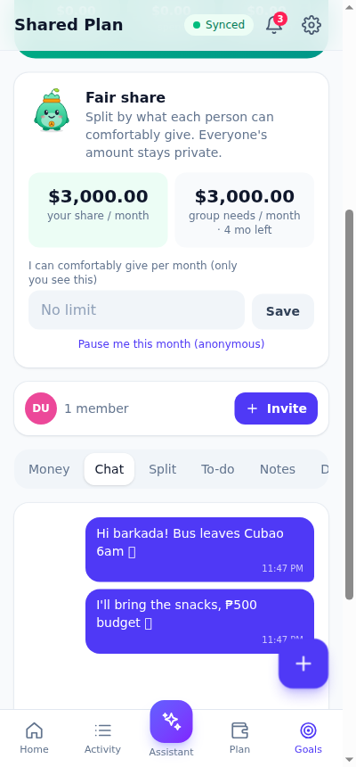
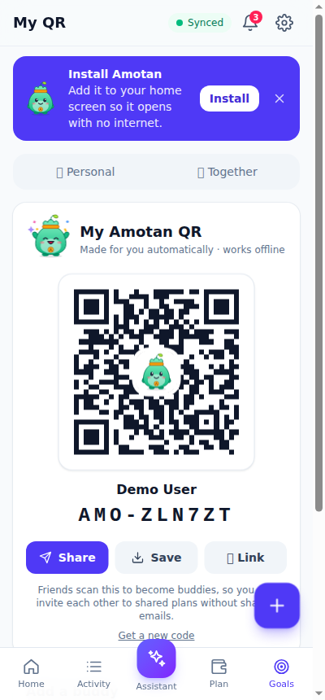
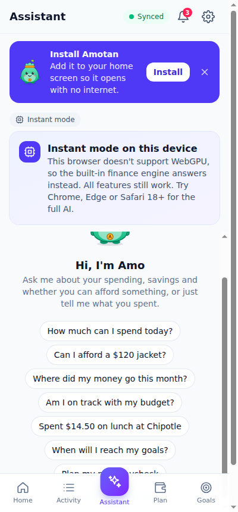
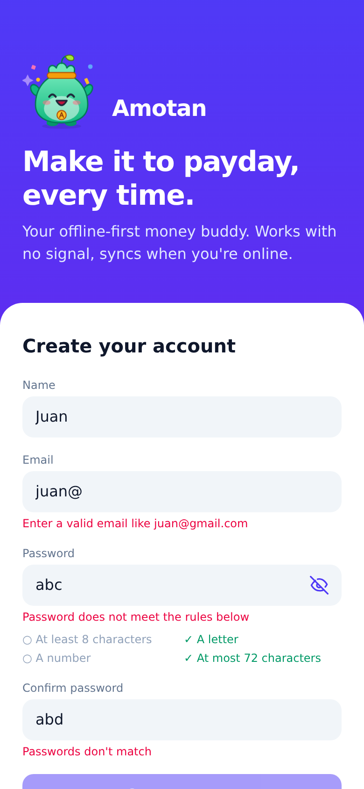

<p align="center">
  
</p>

<h1 align="center">Amotan</h1>
<p align="center"><b>Your offline-first money buddy.</b><br/>Make it to payday, every time, even with no signal.</p>

<p align="center">
  <a href="docs/media/Amotan-Promo-1min.mp4"><b>▶ Watch the 1-minute promo video</b></a> ·
  <a href="#-install-amotan-on-your-phone-first-time-users">Install guide</a> ·
  <a href="#-features">Features</a> ·
  <a href="#-faq">FAQ</a> ·
  <a href="#-for-developers">Developers</a>
</p>

<p align="center">
  <a href="docs/images/amotan-quick-start.jpg"></a>
  <br/><sub>Quick start: how to install and use Amotan. Tap the image to see it full size.</sub>
</p>

---

## 👋 What is Amotan?

Amotan is a budgeting app for students, workers, families and barkadas. It tells you how much you can **safely spend until payday**, warns you **before** money problems happen, and helps groups save together fairly.

Amotan is **offline-first**. Your budget lives on your phone, so it works in the province, on the jeep or with no load. When you're online it **syncs to the cloud** automatically, so your data is backed up and you can log in on another phone.

Its AI assistant, **Amo**, runs **on your own phone**. Your money data is not sent to a cloud AI company, there are no AI subscription fees, and it still answers when you're offline.

### Meet Amo

Amo is a little coin pouch with a sprout, because savings grow. Amo reacts to your money with 17 moods: cheering when you're on track, worried before a shortfall, asleep when you're offline. Tap Amo anywhere for a surprise.

<p align="center"></p>

## 🎬 Promotional video

[**▶ Amotan in 1 minute**](docs/media/Amotan-Promo-1min.mp4): a real demo of the app covering offline sync, Domino Check, barkada plans, personal QR and local AI. Click it, then press **View raw** or the play button to watch.

## ✨ Features

| | |
|---|---|
| 💸 **Safe to spend** | What you can spend until payday after bills and savings, plus a daily allowance. |
| 📴 **Works offline** | Everything you've opened is saved on the device. Changes you make offline wait in an outbox and sync when you're back online, never saved twice. |
| 🁢 **Domino Check** | "What if my salary is 5 days late?" or "What if a ₱3,000 emergency happens?" See the day you'd go short, which bills tip over, and the buffer you need. |
| 👫 **Barkada plans** | Group goals and trips with a **chat room**, **shared notes**, a **calendar**, to-dos, expense splitting and settle-up in the fewest payments. |
| ⚖️ **Fair share** | Each member privately sets what they can comfortably give. Nobody sees anyone else's amount, and members can pause for a month without shame. |
| 🔳 **Personal QR** | Every user gets an auto-generated code (like `AMO-7KX3PQ`). Share it as an image, link or code. Scanning it adds a buddy you can invite to plans in one tap. |
| 🤖 **Local AI (Amo)** | Ask "Can I afford a ₱2,500 phone?", "Where did my money go?" or "What if my salary is late?". It runs on the device and uses the app's own calculated numbers, so the answers match your data. |
| 🧾 **Receipt scan** | Snap a receipt and it's read on your phone (on-device OCR). |
| 🎯 **Goals, bills & debts** | Savings goals with ETA, bill reminders, a debt payoff plan, a payday planner and budgets. |
| 🔐 **Private by design** | Strong password rules, a show-password toggle, and logging out wipes data from the device (good for shared phones). |

<p align="center">
  
  
  
  
  
</p>

## 📲 Install Amotan on your phone (first-time users)

Amotan is a web app you **install from the browser**. No Play Store or App Store needed. It takes about a minute.

> **Important:** turn on internet the **first time** you open Amotan, so it can download itself to your phone. After that it opens and works **without internet**.

### Android (Chrome)

1. Open **Chrome** and go to your Amotan link.
2. Tap **Create an account**, or log in.
3. Tap the **Install Amotan** banner, or tap **⋮ (menu) → Install app / Add to Home screen**.
4. Tap **Install**. Amo now appears on your home screen 🎉
5. Open Amotan from the home screen icon, not the browser.

### iPhone / iPad (Safari)

1. Open **Safari** (it must be Safari) and go to your Amotan link.
2. Create an account or log in.
3. Tap the **Share** button (square with an arrow ↑).
4. Scroll down and tap **Add to Home Screen**, then **Add**.
5. Open Amotan from the new home screen icon.

### Laptop / Desktop (Chrome or Edge)

Open the link, then click the **install icon** (⊕) at the right end of the address bar, or **Menu → Install Amotan**.

### Creating your account

- **Name:** 2 to 60 letters (spaces, dots, hyphens and apostrophes are OK).
- **Email:** a real email format, e.g. `juan@gmail.com`. Capital letters don't matter.
- **Password:** at least **8 characters with a letter and a number**. Tap the 👁 eye icon to show or hide it. Type it again in **Confirm password**.

<p align="center"></p>

### First steps after installing

1. **Welcome setup:** enter your income, payday and main bills. Amo builds your budget.
2. **Home:** check **Safe to spend** and your daily allowance.
3. **Add an expense:** tap **＋**, or tell Amo "lunch 120".
4. **Try Domino Check:** Plan → Domino Check → "Salary 5 days late".
5. **Share your QR:** Settings → **My QR & buddies** → Share.
6. **Start a barkada plan:** Goals → Together → create a plan and invite buddies.

### Using it offline

- Open Amotan as usual. When you're offline, Amo sleeps 😴 and a banner says **Offline**.
- Keep adding expenses, notes, chat messages and events. They're saved on your phone.
- When you're back online they sync automatically (**Settings → Offline & sync** shows what's waiting).
- Things that need the server, such as creating an account or joining a new plan, wait until you're online.

### Demo account

To look around without signing up: **`demo@budget.test` / `password`**. It includes 3 months of sample data, bills, goals and a barkada plan.

## ❓ FAQ

**Do I need internet?** Only the first time (to install) and to sync. Everything else works offline.

**Is my money data safe?** Your data syncs only to your own Amotan account over HTTPS. The AI and receipt reading run on your phone, and no third-party AI service is used. Logging out wipes the device.

**What if I lose my phone?** Log in on a new phone. Anything that had synced is restored from the cloud.

**Why local AI instead of cloud AI?** It keeps your finances private, it's free to run (no per-question AI bills), it's fast, and it works with no signal. Amo takes its numbers from the app's own calculations, so it doesn't make up figures.

**My phone doesn't support the AI model.** That's fine. Amo switches to **instant mode**, which gives the same answers instantly without downloading a model.

**I can't log in.** Check the email spelling. Capital letters and spaces don't matter. Tap the 👁 icon to check your password.

**Where do I find my QR?** Settings → **My QR & buddies**.

## 🛠 For developers

Amotan is a Laravel 13 + Vue 3 PWA (Vite, Tailwind 4, Pinia) with a MySQL/MariaDB database. The offline cache and outbox live in IndexedDB (`resources/js/offline.js`, `resources/js/sync.js`). Synced writes carry an `Idempotency-Key`, so retries are never applied twice (`app/Http/Middleware/IdempotentRequest.php`).

### The AI runs on the device

- **Language model:** [WebLLM](https://github.com/mlc-ai/web-llm) runs Qwen 2.5 / Llama 3.2 in the browser on WebGPU, inside a Web Worker. The model downloads once (about 400 MB to 2 GB, depending on the model chosen in Settings), is cached by the browser, and then works offline. Phones default to Qwen 2.5 0.5B; laptops default to 1.5B.
- **Grounded numbers:** the model never does the maths. `app/Services/FinanceService.php` calculates every figure (safe to spend, affordability, projections). The model gets those facts plus a draft answer and only rephrases them.
- **Instant mode:** devices without WebGPU, or users who turn the AI off, get the same answers from the rule-based engine (`resources/js/ai/parse.js` + `assistant.js`). Every feature works on every device.
- **Receipt OCR:** Tesseract.js and its English language data are self-hosted in `public/vendor/tesseract` (copied from `node_modules` at install/build time). Receipt photos are read on the device and are only uploaded as an attachment when the user saves.
- **Optional self-hosted server model:** set `AI_SERVER_DRIVER=ollama` (plus `OLLAMA_URL` and `OLLAMA_MODEL`) to let users choose a model running on your own machine instead. No third-party AI API is used anywhere.
- **Not used on purpose:** browser speech recognition, because Chrome sends the audio to Google.

### Running it locally

Requirements: PHP 8.3+ (with `intl` and `pdo_mysql`), Composer, Node 20+, MySQL 8 or MariaDB 10.4+.

```bash
composer install
npm install            # also copies the OCR engine into public/vendor/tesseract
cp .env.example .env && php artisan key:generate
# set DB_* in .env, then create the database (e.g. ai_budget_planner)
php artisan migrate --seed
npm run build          # or `npm run dev` while developing
php artisan serve
```

Open http://127.0.0.1:8000 and log in with the demo account from the seeder: **demo@budget.test / password** (3 months of sample data, bills, debts and goals).

#### On a phone

Service workers (installing and offline use) and WebGPU only work over **HTTPS**, or on `localhost`. To try it on a phone, put it behind HTTPS, for example with a tunnel:

```bash
php artisan serve --host=0.0.0.0 --port=8000
cloudflared tunnel --url http://localhost:8000   # or ngrok http 8000
```

Then open the HTTPS URL on the phone and choose **Install** (Android) or **Share → Add to Home Screen** (iOS). For production, deploy behind a normal HTTPS host and set `APP_URL`. Join links and QR codes use the domain the app is served from.

WebGPU support: Chrome/Edge 113+ (desktop and Android), Safari 18+ (iOS 18 / macOS). Other browsers get instant mode automatically.

### Tests

```bash
php artisan test   # 31 feature tests: auth rules, money math, payday planner, alerts, shared plans, chat/notes/calendar, buddies, idempotent sync, privacy
npm test           # 39 unit tests: amount/date/intent parsing, receipt extraction, Domino Check, Amo moods
```

Feature tests run against MySQL (`ai_budget_planner_test`, see `phpunit.xml`), because the app uses MySQL date functions.

### Project map

```
app/Services/FinanceService.php     pay periods, safe-to-spend, projections, affordability, AI context
app/Services/BudgetGenerator.php    personalised budget
app/Services/PaydayPlanner.php      paycheck allocation + daily allowance
app/Services/AlertService.php       spending alerts (deduplicated by key)
app/Services/SharedPlanService.php  shared totals + fewest-payments settle-up
app/Http/Controllers/Api/*          REST API (Sanctum bearer tokens), routes/api.php
resources/js/ai/engine.js           WebLLM loader (WebGPU detection, model choice, worker)
resources/js/ai/assistant.js        intent → grounded facts → on-device LLM or built-in answer
resources/js/ai/parse.js            rule-based NLU (amounts, dates, intents, transactions)
resources/js/ai/receipt.js          on-device OCR + receipt field extraction
resources/js/pages/*                Vue screens; App.vue is the mobile shell (bottom tabs)
public/sw.js, manifest.webmanifest  PWA
```

## Project description & technical disclosure

See [docs/ABOUT-AND-TECHNICAL-DISCLOSURE.md](docs/ABOUT-AND-TECHNICAL-DISCLOSURE.md) for the problems Amotan solves and the full list of technologies, libraries, licenses and browser APIs used.

## Not financial advice

The assistant gives general budgeting help only. For investment, tax or legal decisions, users should talk to a licensed professional.
